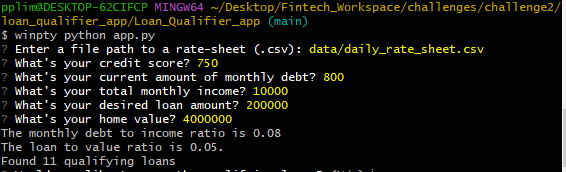
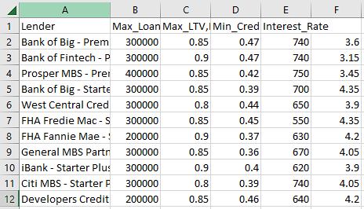

# Loan Qualifier Application

This project allows a user to quickly filter through a list of loans and find the ones they would be approved for. It will request an input of user information to output a csv file listing the approved loans.

---

## Technologies

This program runs on python 3.10.9 and requires pip 22.3.1 to be installed.
Python fire must be installed on the command line interface (CLI).
Libraries: sys, fire, questionary, csv, and pathlib.
For windows operating systems running the git bash program.

---

## Installation Guide

Install the latest version of python and git bash.
Install python fire by running the following code on the CLI:
'pip install fire'
Navigate to the Loan_Qualifier_app folder using the terminal.
The program should now be ready to run!
**Note:** To run this program type 'winpty python app.py' into the git bash terminal after navigating to the correct folder.

---

## Usage

To run this program from the CLI:
Type 'winpty python app.py'
Enter the filepath to the rate sheet you would like to search through. By default this will be *data/daily_rate_sheet.csv*
Enter the user information requested and the number of qualifying loans will be displayed:

Type Y to save the list of loans to a csv file. Otherwise, type N.
If you decided to save the list of loans, type the file path to where you would like to save the csv file.
The qualifying loans will be saved in the following format:

---

## Contributors

By Brian Wander
brianwander101@gmail.com

---

## License

Free to use with proper attribution.
